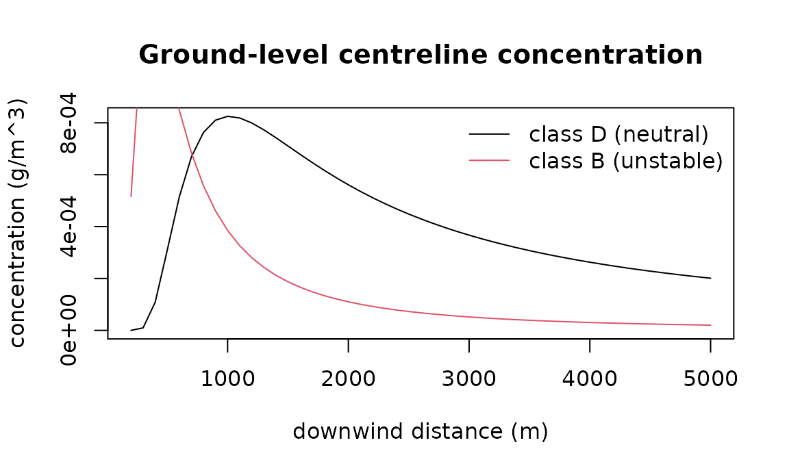

# Air pollution: dispersion, health burden, equity, and the footprint of the computation

Three questions about air pollution recur in administrative and
public-health work: where does a plume go, how many deaths does a
concentration imply, and who bears it. A fourth has become part of
reproducible research: what did the computation itself cost in
electricity and carbon. This vignette walks the four tools, each with
the formula it implements and the paper it comes from, on small offline
examples.

## 1. Where the plume goes

### Dispersion coefficients

The Gaussian plume model needs the horizontal and vertical spread of the
plume as a function of downwind distance and atmospheric stability.
Pasquill’s stability classes A (very unstable) to F (very stable) with
Briggs’s (1973) curve fits are the standard parameterisation; rural and
urban coefficients differ because cities are rougher and warmer.

``` r

pg_sigmas(1000, "D")
#> $sigma_y
#> [1] 76.27701
#> 
#> $sigma_z
#> [1] 37.94733
pg_sigmas(1000, "D", setting = "urban")
#> $sigma_y
#> [1] 135.2247
#> 
#> $sigma_z
#> [1] 122.7881
```

### Plume rise

A hot, fast stack gas rises before it levels off. Briggs’s plume-rise
equations give the buoyancy flux, the final rise and the distance at
which it is reached; before that distance the plume is still rising:

``` r

r <- briggs_plume_rise(c(100, 500, 2000), u = 4, diameter = 1, exit_velocity = 12,
                       stack_temp = 420, ambient_temp = 285)
r$flux
#> [1] 9.45594
r$final_rise
#> [1] 28.88281
r$rise
#> [1] 18.22335 28.88281 28.88281
```

### Ground-level concentration

With the effective height (stack height plus rise), the plume equation
gives the concentration at any receptor; ground reflection is included,
and a mixing lid adds image terms. Concentration first rises with
distance as the plume reaches the ground, then falls as it dilutes:

``` r

x <- seq(200, 5000, by = 100)
h <- 30 + r$final_rise
c_d <- gaussian_plume(q = 100, u = 4, h = h, receptors = cbind(x, 0, 0), stability = "D")
c_b <- gaussian_plume(q = 100, u = 4, h = h, receptors = cbind(x, 0, 0), stability = "B")
plot(x, c_d, type = "l", xlab = "downwind distance (m)", ylab = "concentration (g/m^3)",
     main = "Ground-level centreline concentration")
lines(x, c_b, col = 2)
legend("topright", c("class D (neutral)", "class B (unstable)"), col = 1:2, lty = 1, bty = "n")
```



[`gaussian_puff()`](https://rootcoder007.github.io/rmorie-bricklayer/reference/pg_sigmas.md)
is the instantaneous-release counterpart;
[`advection_diffusion_2d()`](https://rootcoder007.github.io/rmorie-bricklayer/reference/pg_sigmas.md)
and
[`lagrangian_particles()`](https://rootcoder007.github.io/rmorie-bricklayer/reference/pg_sigmas.md)
are grid and particle models for cases the Gaussian assumptions (steady
wind, flat terrain) do not fit. The particle model is deterministic from
its seed and takes any normal generator through `normals=`, so another
package’s random stream can be reproduced exactly.

``` r

p <- lagrangian_particles(n = 500, x0 = 0, y0 = 0, u = 1, v = 0, kx = 0.5, ky = 0.5,
                          dt = 1, n_steps = 50, seed = 1, grid = c(0, 100, -30, 30, 20, 12))
c(mean_x = p$mean_x, mean_y = p$mean_y)
#>       mean_x       mean_y 
#> 49.981881150  0.009562424
```

## 2. From concentration to deaths

### Concentration-response

The relative risk of death at an ambient concentration, relative to a
counterfactual concentration below which no excess risk is assumed. The
all-cause PM2.5 function is log-linear with the pooled cohort estimate
of the WHO 2021 guideline review, RR 1.08 per 10 µg/m³ (Chen and Hoek
2020); NO2 uses RR 1.02 per 10 µg/m³ (Huangfu and Atkinson 2020). The
cause-specific PM2.5 functions are the Integrated Exposure-Response
curves of Burnett et al. (2014), which saturate at high concentrations:

``` r

crf_pm25(12)$rr
#> [1] 1.048873
exp(log(1.08) * (12 - 5.8) / 10)          # the same, by hand
#> [1] 1.048873
crf_pm25(12, outcome = "ihd")$rr
#> [1] 1.553634
crf_no2(25)$rr
#> [1] 1.03015
```

A vector of exposures gives the mean RR and keeps the per-unit values:

``` r

v <- crf_pm25(c(6, 10, 15, 22))
v$rr
#> [1] 1.060136
v$extra$rr_per_unit
#> [1] 1.001540 1.032852 1.073371 1.132782
```

### Attributable fraction and avoided deaths

Levin’s population attributable fraction turns a relative risk and an
exposure prevalence into the share of deaths the exposure accounts for;
the BenMAP health-impact function gives the deaths avoided by a
counterfactual reduction:

``` r

attributable_fraction(crf_no2(25)$rr, exposure_prevalence = 1)
#> [1] 0.02926711
mortality_displaced(exposure_delta = 10, population = 1e6, baseline_rate = 0.008,
                    beta_per_unit = log(1.02) / 10)
#> [1] 156.8627
```

### The burden chain

[`pollution_burden()`](https://rootcoder007.github.io/rmorie-bricklayer/reference/pollution_burden.md)
chains concentration-response, attributable fraction and the baseline
case count, as the Global Burden of Disease risk-factor estimates do:

``` r

b <- pollution_burden(exposure_mean = 25, exposure_prevalence = 1, baseline_rate = 0.008,
                      population = 1e6, pollutant = "NO2")
c(rr = b$extra$rr, paf = b$paf, attributable = b$attributable_cases)
#>           rr          paf attributable 
#>   1.03014950   0.02926711 234.13691783
b$citation
#> [1] "Huangfu & Atkinson (2020) Environ Int 144:105998; WHO (2021) Global AQ Guidelines; Rothman et al. (2008) section 5"
```

Per area, sorted worst first:

``` r

areas <- data.frame(fsa = c("M6H", "M5V", "M4W", "M1B"), exposure = c(28, 18, 15, 24),
                    population = c(40000, 60000, 25000, 70000), baseline_rate = 0.008)
pollution_burden_by_area(areas)
#>   fsa exposure population baseline_rate       rr         paf attributable_cases
#> 1 M1B       24      70000         0.008 1.028112 0.027342904          15.312026
#> 2 M6H       28      40000         0.008 1.036288 0.035016937          11.205420
#> 3 M5V       18      60000         0.008 1.015968 0.015717276           7.544292
#> 4 M4W       15      25000         0.008 1.009950 0.009852457           1.970491
#>   baseline_cases
#> 1            560
#> 2            320
#> 3            480
#> 4            200
```

## 3. Who bears it

The concentration index of Wagstaff, Paci and van Doorslaer (1991)
measures whether exposure concentrates among lower- or higher-income
people: it is twice the covariance of exposure with the fractional
income rank, divided by mean exposure. Negative means the poor bear
more.

``` r

d <- data.frame(exposure = c(30, 27, 22, 18, 14), income = 1:5)
e <- exposure_concentration_index(d, "exposure", "income")
e$concentration_index
#> [1] -0.1477477
e$interpretation
#> [1] "CI = -0.1477. Pro-poor exposure burden: lower-income individuals bear disproportionately higher pollution."
```

## 4. Estimating the exposure effect from your own data

When individual or area data with confounders are available, the
partially linear model of Chernozhukov et al. (2018) estimates the
exposure effect with cross-fitted nuisance functions, so the confounder
adjustment cannot overfit the same rows it is evaluated on.
[`exposure_response_plr()`](https://rootcoder007.github.io/rmorie-bricklayer/reference/exposure_response_plr.md)
adds a percentile bootstrap for a sensitivity interval. The default
estimator uses ordinary-least-squares nuisances; any estimator with the
same interface can be passed.

``` r

set.seed(1)
n <- 300
sim <- data.frame(income = rnorm(n), density = rnorm(n))
sim$no2 <- 20 - 2 * sim$income + 3 * sim$density + rnorm(n)
sim$asthma_rate <- 5 + 0.3 * sim$no2 - 0.5 * sim$income + rnorm(n)
fit <- exposure_response_plr(sim, outcome = "asthma_rate", exposure = "no2",
                             confounders = c("income", "density"), n_bootstrap = 30)
c(ate = fit$ate, lower = fit$ci_lower_bs, upper = fit$ci_upper_bs)
#>       ate     lower     upper 
#> 0.2464713 0.1437978 0.3132657
```

The true coefficient is 0.3 and the interval covers it.

## 5. The whole pipeline, with an assumption log

[`verify_pollution()`](https://rootcoder007.github.io/rmorie-bricklayer/reference/verify_pollution.md)
runs the chain end to end and records every assumption it checked, so a
report says not only the number but the conditions under which it holds.
Synthetic demo data stand in here:

``` r

r <- verify_pollution("no2", demo = TRUE, region = "demo", years = "2024")
r$status
#> [1] "ok"
cat(pollution_report_text(r))
#> ==================================================================
#>   verify-pollution -- NO2 -> all_cause_mortality
#>   region: demo
#>   years:  2024
#>   data:   demo (synthetic)
#> ==================================================================
#> 
#> Inputs
#>   exposure mean:      24.261
#>   exposure prevalence:0.981
#>   baseline rate/100k: 500.00
#>   population:         1e+06
#>   reference conc:     10
#> 
#> Assumption log
#>   [PASS] exposure finite and non-negative -- mean 24.26113743 vs ref 10
#>   [PASS] prevalence in [0,1] -- exposure_prevalence=0.981
#>   [PASS] baseline_rate finite and non-negative -- baseline_rate=500 per 100k per year
#>   [PASS] population finite and positive -- population=1e+06
#>   [PASS] reference finite and non-negative -- reference=10
#>   [PASS] pollutant supported by the CRFs -- Current CRFs: NO2 (log-linear), PM2.5 (log-linear all-cause; Burnett IER for IHD and stroke). Other pollutants reject.
#> 
#> Concentration-response
#>   RR:       1.0286
#>   source:   Huangfu & Atkinson (2020) Environ Int 144:105998; WHO (2021) Global AQ Guidelines
#> 
#> Attributable fraction (PAF): 0.0273
#> 
#> Mortality displaced
#>   expected avoided deaths: 136.6
#> 
#> Burden of pollution
#>   attributable deaths:   136.7
#> 
#> Equity analysis
#>   concentration index: -0.0647
#> 
#> STATUS: ok
```

An input that violates an assumption stops the pipeline and says why,
with a non-zero exit status for scripts:

``` r

bad <- verify_pollution("pm25", exposure_mean = 3, exposure_prevalence = 0.5)
bad$status
#> [1] "ok"
attr(bad, "exit_status")
#> [1] 0
```

A CSV with an `exposure` column (and optionally `income`) replaces the
demo data; a NAPS pull with `value` in ppb is converted to µg/m³ at 1.88
for NO2.

## 6. What did this computation cost?

Computation uses electricity, and electricity has a carbon intensity.
[`compute_footprint()`](https://rootcoder007.github.io/rmorie-bricklayer/reference/compute_footprint.md)
reports both for any expression, two ways. On Linux with readable RAPL
counters it *measures* the CPU package energy, as codecarbon does.
Everywhere else it *models* energy with the Green Algorithms formula
(Lannelongue, Grealey and Inouye 2021),
$`E = t\,(P_{cpu} u + M \cdot 0.3725\,\mathrm{W/GB})\,PUE`$. Every
default that stood in for a measurement is listed:

``` r

rapl_available()
#> [1] FALSE
fp <- compute_footprint(sum(sqrt(seq_len(3e5))), location = "CA-ON", cpu_power_w = 45,
                        memory_gb = 16)
print(fp)
#> Computation footprint (modelled): 0.003 s wall, 0.003 s CPU, utilisation 0.25 (process) on 4 cores
#>   energy: 1.43e-08 kWh (cpu 9.37e-09, memory 4.97e-09)
#>   CO2e:   1.3e-06 g at 90.97 gCO2e/kWh (Canada, Ontario, 2024)
fp$assumptions
#> character(0)
```

### Utilisation: measured, per process or per machine

The Green Algorithms calculator asks the user for the utilisation $`u`$
and defaults to 1; codecarbon measures it in one of two tracking modes.
[`compute_footprint()`](https://rootcoder007.github.io/rmorie-bricklayer/reference/compute_footprint.md)
measures it too, in the same two ways. `usage = "process"` (the default)
is this R process’s own CPU time, children included, over wall time and
cores, so an idle wait is not charged as computation.
`usage = "machine"` is the whole machine’s busy share over the run, read
from `/proc/stat` on Linux, for the case where the computation is all
the machine is doing or the question is what the machine drew; where
there is no `/proc/stat` the process figure is used and the assumptions
say so. A number fixes it, as the calculator does. `load_curve` chooses
how power follows utilisation: linearly (Green Algorithms) or along
codecarbon’s curves, a 10% floor for a process and $`0.1 + 0.9u^3`$ for
a machine, so a figure can be made comparable with either tool:

``` r

busy <- function() sum(sqrt(seq_len(2e5)))
a <- compute_footprint(busy(), location = "CA-ON", cpu_power_w = 45, memory_gb = 16)
b <- compute_footprint(busy(), location = "CA-ON", cpu_power_w = 45, memory_gb = 16,
                       usage = "machine", load_curve = "codecarbon")
rbind(process_linear = c(usage = a$usage, cpu_kwh = a$energy_kwh$cpu),
      machine_codecarbon = c(usage = b$usage, cpu_kwh = b$energy_kwh$cpu))
#>                        usage   cpu_kwh
#> process_linear     0.1666667 6.250e-09
#> machine_codecarbon 0.4000000 2.364e-08
b$usage_mode
#> [1] "machine"
```

### The grid: the latest year, every country, offline

The carbon intensity comes from a table bundled with the package, so
nothing is fetched and it works in any country: every country at the
latest year Our World in Data publishes from Ember’s yearly electricity
data (2024 or 2025 at this release), sub-national zones from Electricity
Maps’ 2024 yearly data as redistributed by Green Algorithms (Canadian
provinces, US balancing authorities, Australian states, Indian and
Japanese regions, …), and the world average. Each row carries its year
and source, so a report can cite them. A location is matched by code,
alpha-3 code or name; an unknown zone falls back to its country and says
so; a number of your own is accepted when you have a better figure:

``` r

carbon_intensity("CA-ON")[c("g_per_kwh", "year", "source")]
#> $g_per_kwh
#> [1] 90.97
#> 
#> $year
#> [1] 2024
#> 
#> $source
#> [1] "Electricity Maps (2025). Canada 2024 Yearly Carbon Intensity Data (Version January 27, 2025). Electricity Maps (via Green Algorithms data v3.1)"
carbon_intensity("Kenya")[c("location", "g_per_kwh", "year")]
#> $location
#> [1] "KE"
#> 
#> $g_per_kwh
#> [1] 95.44
#> 
#> $year
#> [1] 2025
carbon_intensity("CA-XX")$note
#> [1] "no row for zone CA-XX; its country CA used"
tab <- carbon_intensity_table()
nrow(tab)
#> [1] 379
table(nchar(tab$location) == 2, tab$year)[, c("2024", "2025")]
#>        
#>         2024 2025
#>   FALSE  156    3
#>   TRUE   125   91
```

With `location = NULL` (the default) the location is detected offline,
in order, from the `RMBL_LOCATION` environment variable, codecarbon’s
`CODECARBON_COUNTRY_ISO_CODE`, the system time zone (`America/Toronto`
is Canada, `Asia/Kolkata` India) and the locale, and the detection is
written into the assumptions; when nothing is found the world average is
used and the result says so, so one country’s grid is never silently
applied to another’s computation:

``` r

detect_location()
#> $location
#> [1] "WORLD"
#> 
#> $method
#> [1] "fallback, no location found in environment, time zone or locale"
detect_location(env_location = "", codecarbon_location = "", tz = "Asia/Kolkata")
#> $location
#> [1] "IN"
#> 
#> $method
#> [1] "system time zone Asia/Kolkata"
compute_footprint(1 + 1, cpu_power_w = 45, memory_gb = 16)$assumptions[1]
#> [1] "location WORLD via fallback, no location found in environment, time zone or locale"
```

For a long analysis the figures become meaningful; the equivalents are
the two the Green Algorithms calculator prints:

``` r

footprint_equivalents(fp$co2e_g * 1e4)   # if this ran ten thousand times
#> $car_km
#> [1] 7.455208e-05
#> 
#> $tree_months
#> [1] 1.42275e-05
#> 
#> $sources
#>                                                                  car 
#> "175 gCO2/km, European passenger car (Green Algorithms context.csv)" 
#>                                                                 tree 
#>             "917 gCO2 per tree-month (Green Algorithms context.csv)"
```

**Cross-checked against codecarbon.** On the same 8-second CPU-bound
workload with the same forced inputs (65 W CPU, 16 GB at 0.3725 W/GB),
codecarbon 3.3.1 and
[`compute_footprint()`](https://rootcoder007.github.io/rmorie-bricklayer/reference/compute_footprint.md)
charged the memory identically (5.96 W) and the CPU within 8%;
`load_curve = "codecarbon"` reproduces codecarbon’s power-from-load
curves, so what remains of the difference is the load measurement itself
(codecarbon samples it during the run, this function integrates the CPU
time). The carbon intensity they applied to Canada differed (170 g/kWh
from codecarbon’s 2023 Our World in Data figure; 190.7 g/kWh from the
2025 figure bundled here), which is the point of carrying the year with
every row: grid intensities move, and a report should cite the year of
the one it used. CodeCarbonR on CRAN wraps the same Python tracker
through reticulate; this function needs no Python and no network.

**What this does and does not cover.** The measured mode reads the CPU
packages only; memory, storage, network and GPU are not in the RAPL
counters (GPU power needs the vendor library; this package has no GPU
dependency). The modelled mode inherits Green Algorithms’ assumptions:
memory draws 0.3725 W/GB regardless of how it is populated (codecarbon
v3 moved to a per-DIMM heuristic for the same reason), and the grid
intensity is an annual average, not the hour’s. Embodied emissions of
the hardware are excluded, as in both reference tools. The place to
improve a figure is the inputs: a measured `cpu_power_w` for your CPU,
the actual `memory_gb` your job used, the data centre’s `pue`, and, if
you have it, the hour’s carbon intensity passed as a number.

## References

Briggs (1973). Diffusion estimation for small emissions. ATDL 79. Briggs
(1975). Plume rise predictions. AMS. Burnett et al. (2014). An
integrated risk function for estimating the global burden of disease
attributable to ambient fine particulate matter exposure. *EHP* 122(4).
Chen, Hoek (2020). Long-term exposure to PM and all-cause and
cause-specific mortality. *Environment International* 143. Chernozhukov
et al. (2018). Double/debiased machine learning. *Econometrics Journal*
21(1). Huangfu, Atkinson (2020). Long-term exposure to NO2 and O3 and
all-cause and respiratory mortality. *Environment International* 144.
Lannelongue, Grealey, Inouye (2021). Green Algorithms: quantifying the
carbon footprint of computation. *Advanced Science* 8(12), 2100707.
Ember (2026). Yearly Electricity Data, via Our World in Data,
<https://ourworldindata.org/grapher/carbon-intensity-electricity>.
Electricity Maps (2025). 2024 Yearly Carbon Intensity Data, via Green
Algorithms data v3.1. Levin (1953). The occurrence of lung cancer in
man. *Acta Unio Internationalis Contra Cancrum* 9. Wagstaff, Paci, van
Doorslaer (1991). On the measurement of inequalities in health. *Social
Science and Medicine* 33(5). WHO (2021). Global Air Quality Guidelines.
