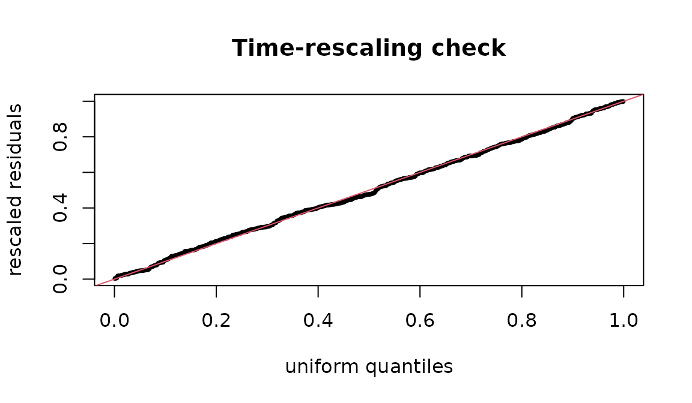

# Hawkes processes: self-exciting event series

Many administrative event series cluster: one incident raises the chance
of another soon after. A **Hawkes process** (Hawkes 1971) models this
directly. Its conditional intensity, the instantaneous event rate given
the past, is

``` math
\lambda(t) = \mu + \sum_{t_i < t} \phi(t - t_i),
```

a baseline rate $`\mu`$ plus a kernel $`\phi`$ that each past event adds
and that decays with the time since it. The integral of the kernel,
$`n = \int_0^\infty \phi(s)\,ds`$, is the **branching ratio**: the
expected number of events each event directly triggers. When $`n < 1`$
the process is stationary; $`n`$ is the fraction of events that are
“children” of earlier events rather than arrivals from the baseline,
which is often the quantity of substantive interest.

## Simulating a Hawkes process

Ogata’s thinning algorithm simulates the process exactly: propose events
from an upper bound on the intensity and keep each with probability
$`\lambda(t)/\lambda_{\max}`$. Here is an exponential kernel
$`\phi(s) = \alpha \beta e^{-\beta s}`$, whose branching ratio is
$`\alpha`$:

``` r

simulate_hawkes <- function(mu, alpha, beta, horizon, seed = 1) {
  set.seed(seed)
  t <- 0
  events <- numeric(0)
  while (t < horizon) {
    lambda_max <- mu + alpha * beta * sum(exp(-beta * (t - events)))
    t <- t + stats::rexp(1, lambda_max)
    if (t >= horizon) break
    lambda_t <- mu + alpha * beta * sum(exp(-beta * (t - events)))
    if (stats::runif(1) <= lambda_t / lambda_max) events <- c(events, t)
  }
  events
}
times <- simulate_hawkes(mu = 1, alpha = 0.5, beta = 2, horizon = 300)
length(times)
#> [1] 559
```

## Fitting

[`core_hawkes_fit()`](https://rootcoder007.github.io/rmorie-bricklayer/reference/core_hawkes_fit.md)
maximises the exact log-likelihood with an analytic gradient in C
(projected BFGS, with the parameters bounded). `theta` holds the
baseline, the branching ratio and the kernel parameter:

``` r

fit <- core_hawkes_fit(times, horizon = 300, kernel = "exponential")
fit$theta
#> [1] 0.1027148 0.4073514 2.1590220
fit$branching_ratio
#> [1] 0.4073514
```

The branching ratio is recovered close to the 0.5 the data were
simulated with, and the baseline close to 1. Four kernels are available:
`exponential` (memoryless decay), `weibull` and `gamma` (a delayed
peak), `lomax` (a heavy tail: influence that fades slowly). Compare them
by information criterion:

``` r

sapply(c("exponential", "weibull", "lomax"), function(k) {
  core_hawkes_fit(times, 300, kernel = k)$aic
})
#> exponential     weibull       lomax 
#>    352.1139    353.6296    354.1802
```

A **sinusoidal baseline** lets the background rate follow a cycle (a
weekly or seasonal pattern) instead of staying constant:

``` r

core_hawkes_fit(times, 300, kernel = "exponential", baseline = "sinusoidal")$aic
#> [1] 352.3058
```

## Checking the fit: time-rescaling residuals

If the fitted intensity is right, the compensator
$`\Lambda(t_i) = \int_0^{t_i}\lambda(s)\,ds`$ turns the event times into
a unit-rate Poisson process (the time-rescaling theorem; Brown et
al. 2002).
[`core_hawkes_residuals()`](https://rootcoder007.github.io/rmorie-bricklayer/reference/core_hawkes_residuals.md)
returns the rescaled inter-event quantities, which should then be
uniform:

``` r

U <- core_hawkes_residuals(times, 300, "exponential", fit$theta)
stats::ks.test(U, "punif")$p.value
#> [1] 0.8168762
```

``` r

plot(stats::qunif(stats::ppoints(length(U))), sort(U), pch = 20, cex = .6,
     xlab = "uniform quantiles", ylab = "rescaled residuals",
     main = "Time-rescaling check")
abline(0, 1, col = 2)
```



A misspecified kernel shows as a departure from the diagonal; a p-value
well below 0.05 says the model does not explain the clustering it was
fitted to.

## Events recorded to a resolution

Administrative data record dates, not instants. Many events on one day
are *ties*, and a Hawkes likelihood with tied times is ill-defined (the
kernel at lag zero).
[`core_hawkes_jitter()`](https://rootcoder007.github.io/rmorie-bricklayer/reference/core_hawkes_jitter.md)
spreads each day’s events uniformly across that day, deterministically
from a seed, so the fit is reproducible and no two events coincide:

``` r

days <- c(0, 0, 0, 1, 3, 3)
core_hawkes_jitter(days)
#> [1] 0.1599104 0.2786011 0.7415649 1.3441907 3.0380302 3.8682281
anyDuplicated(core_hawkes_jitter(days))
#> [1] 0
```

Fit on jittered times, and treat the day as the unit of the horizon.

## Evaluating a likelihood directly

[`core_hawkes_nll()`](https://rootcoder007.github.io/rmorie-bricklayer/reference/core_hawkes_nll.md)
returns the negative log-likelihood at given parameters, for profile
plots, likelihood-ratio comparisons or a check against another
implementation:

``` r

core_hawkes_nll(times, 300, "exponential", fit$theta)
#> [1] 173.0569
core_hawkes_nll(times, 300, "exponential", fit$theta * 1.5)
#> [1] 193.815
```

## Boundaries and identifiability

A heavy-tailed kernel that tends to its exponential limit has a shape
parameter that is not identified; the fit then stops at the parameter
bound and says so (`fit$at_bound`), instead of reporting an absurd
estimate. Short series carry little information about the kernel’s
shape: with a few hundred events, compare kernels by AIC but do not read
much into the third decimal of a shape parameter.

## References

Hawkes (1971). Spectra of some self-exciting and mutually exciting point
processes. *Biometrika* 58(1). Ogata (1981). On Lewis’ simulation method
for point processes. *IEEE Trans. Inf. Theory*. Brown, Barbieri,
Ventura, Kass, Frank (2002). The time-rescaling theorem and its
application to neural spike train data analysis. *Neural Computation*
14(2).
