# Plotting results

Every result the package returns draws itself. `plot(x)` needs nothing
but the object; the chart is the one that result calls for, drawn with
base graphics (no new dependency), with one shared look across the
package. Every method takes the same customisation, and every method
returns the numbers it drew, so a figure can be checked or redrawn
another way.

## One call per result

Stock and flow after Lakner (1976): the average daily population and the
length of stay, one panel per measure.

``` r

sf <- stock_flow(days = c(13500, 14600, 15100, 14200), people = c(300, 320, 310, 290),
                 period = 2020:2023)
plot(sf)
```

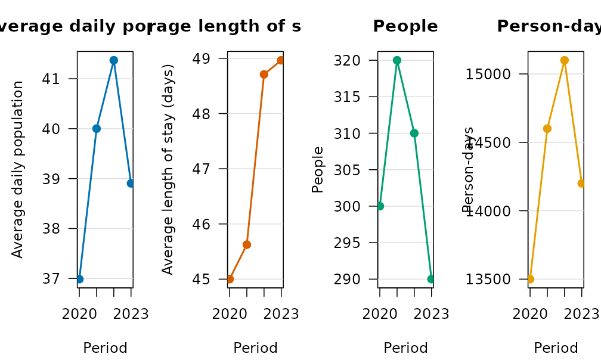

Period-over-period change with its interval, coloured by verdict:

``` r

y <- yoy(data.frame(year = 2018:2023, n = c(40, 44, 41, 55, 52, 61)), value = "n",
         period = "year")
plot(y)
```

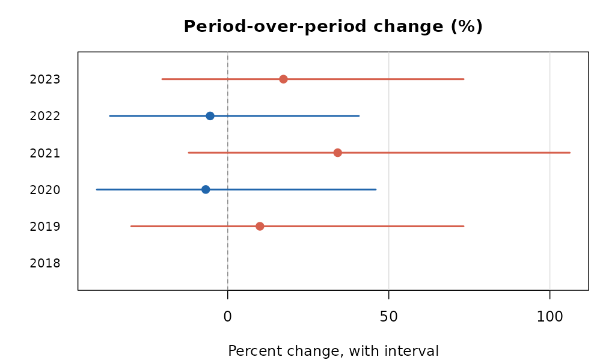

Rates with their intervals, and the change in a rate:

``` r

d <- data.frame(division = rep(c("north", "east", "west"), 2), year = rep(2022:2023, each = 3),
                stops = c(120, 90, 60, 150, 85, 70), residents = c(1e4, 8e3, 5e3, 1e4, 8e3, 5e3))
plot(rate(d[d$year == 2023, ], count = "stops", population = "residents", by = "division"))
```

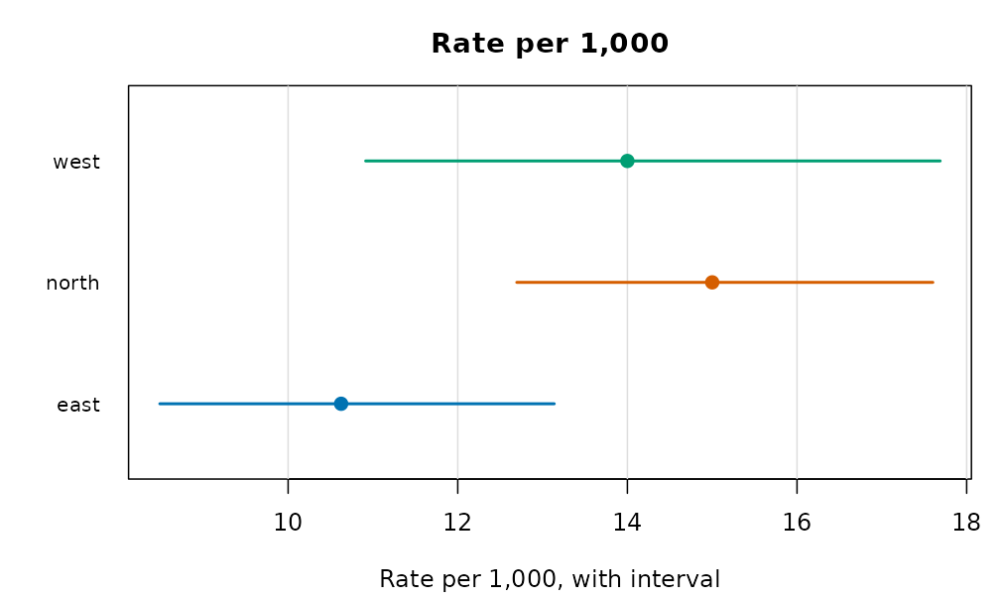

``` r

plot(rate_change(d, count = "stops", population = "residents", period = "year", by = "division"))
```

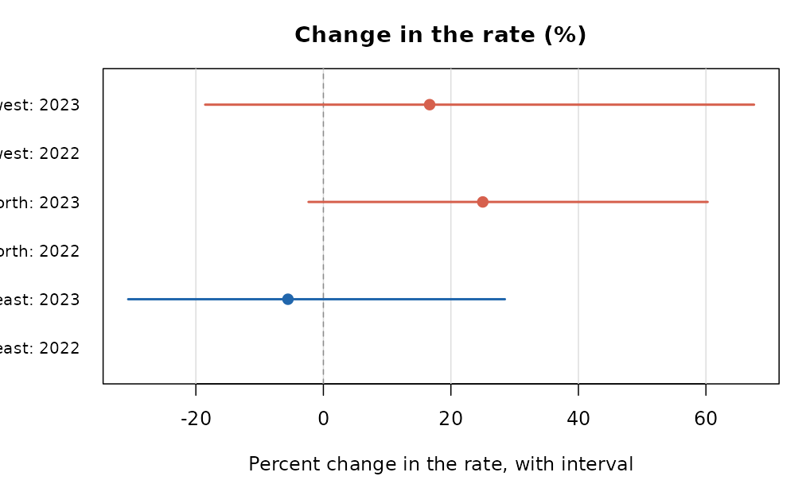

First digits against Benford’s law, the power curve of a check, and a
permutation null:

``` r

set.seed(1)
amounts <- round(exp(rnorm(400, 6, 1.4)))
plot(benford_test(amounts))
```

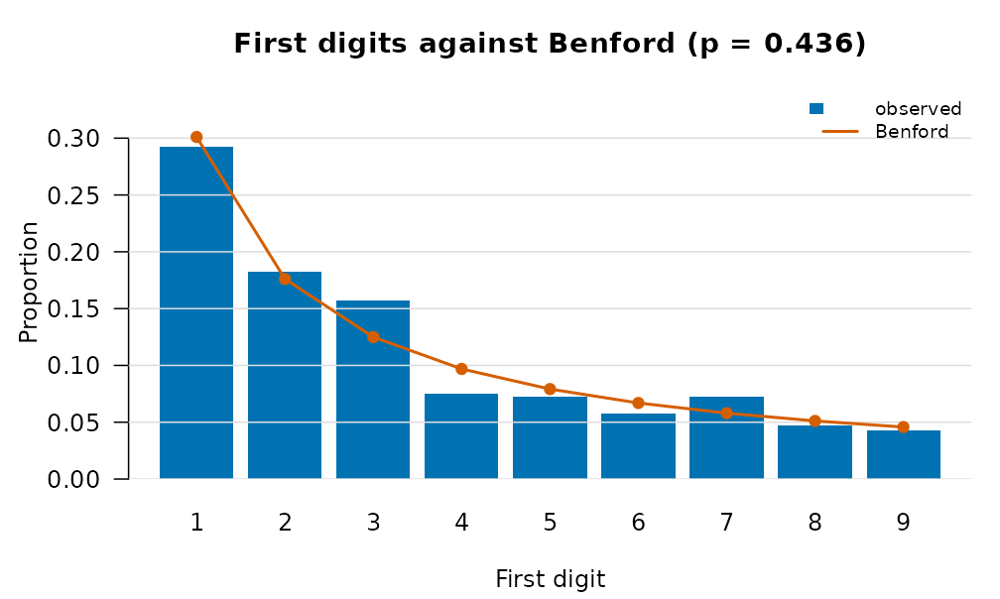

``` r

dd <- data.frame(x = rnorm(120), y = rnorm(120))
shift <- function(z, s) {
  z$y <- z$y + s * z$x
  z
}
plot(capsule_power(dd, function(z) cor(z$x, z$y), inject = shift, treatment = "x",
                   sizes = c(0, 0.2, 0.4, 0.6), n = 49, reps = 6, seed = 1))
```

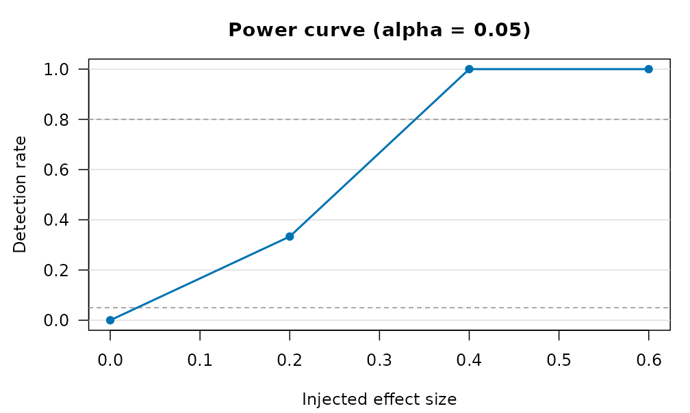

## Air pollution

The concentration-response curve with the exposure marked, the burden it
implies, and the whole
[`verify_pollution()`](https://rootcoder007.github.io/rmorie-bricklayer/reference/verify_pollution.md)
report on one page (curve, burden and the concentration curve of
exposure over income):

``` r

plot(crf_no2(25))
```

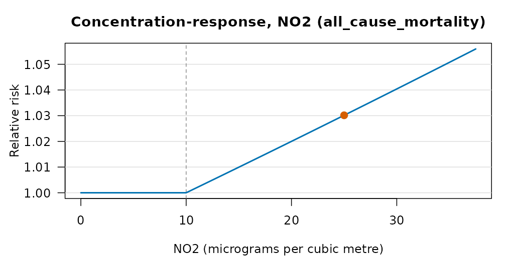

``` r

plot(pollution_burden(25, 1, 0.008, 1e6, pollutant = "NO2"))
```

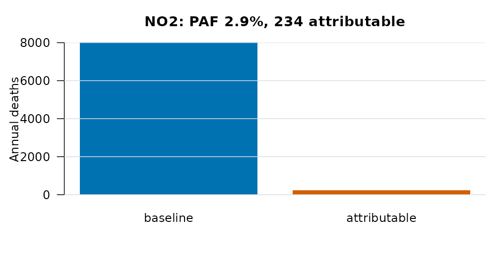

``` r

plot(verify_pollution("no2", demo = TRUE))
```

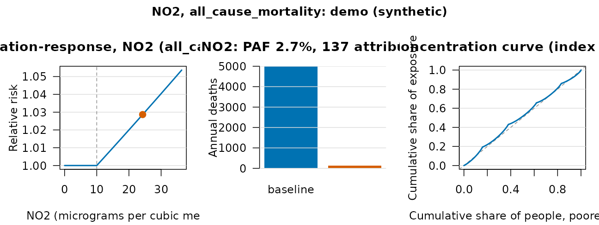

A plume on a grid, and the particle cloud of the random walk:

``` r

plot(plume_field(q = 100, u = 5, h = 50, x = seq(100, 3000, by = 100),
                 y = seq(-500, 500, by = 50)))
```

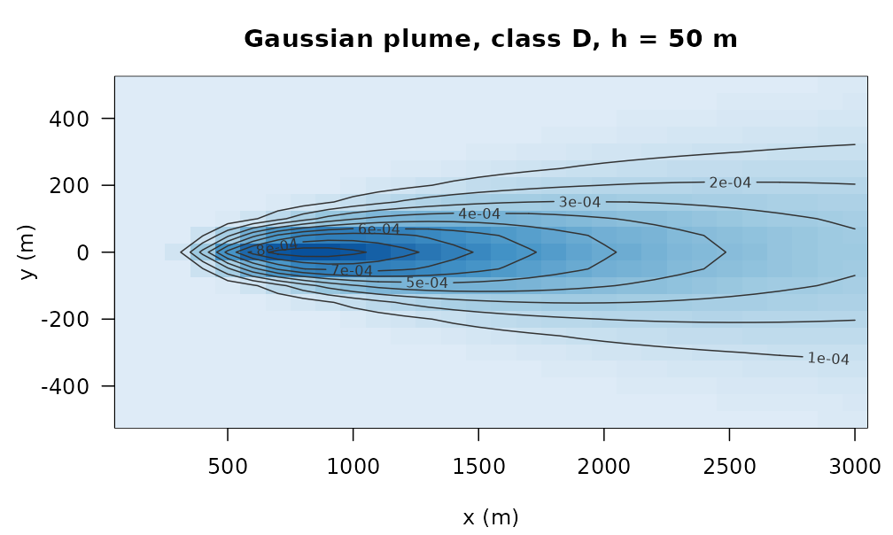

``` r

plot(lagrangian_particles(500, 0, 0, u = 2, v = 0.5, kx = 1, ky = 1, dt = 1, n_steps = 60,
                          grid = c(0, 200, -60, 100, 40, 32)))
```

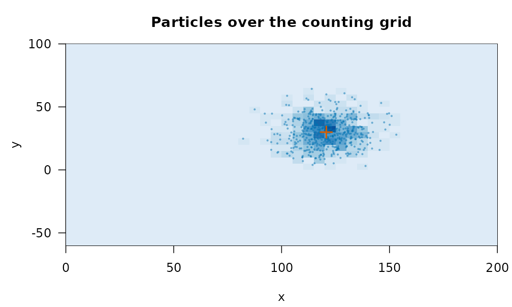

The footprint of a computation, with its equivalents:

``` r

plot(compute_footprint(sum(sqrt(1:1e5)), location = "CA", cpu_power_w = 45, memory_gb = 8))
```

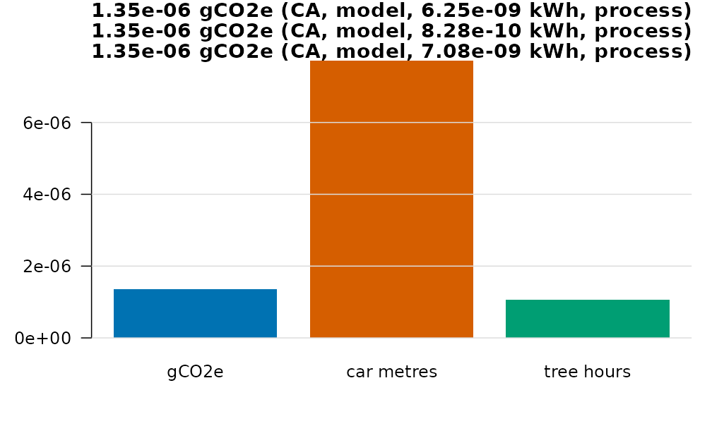

## Customising

Every method takes `main`, `col` (or a `palette` name), `grid`, and
`...` for the base-graphics call.
[`bricklayer_plot_options()`](https://rootcoder007.github.io/rmorie-bricklayer/reference/bricklayer_palette.md)
sets the session defaults;
[`bricklayer_palette()`](https://rootcoder007.github.io/rmorie-bricklayer/reference/bricklayer_palette.md)
gives the colour-blind-safe sets the package uses.

``` r

plot(sf, what = "alos", col = "firebrick", main = "Length of stay (days)", lwd = 3)
```

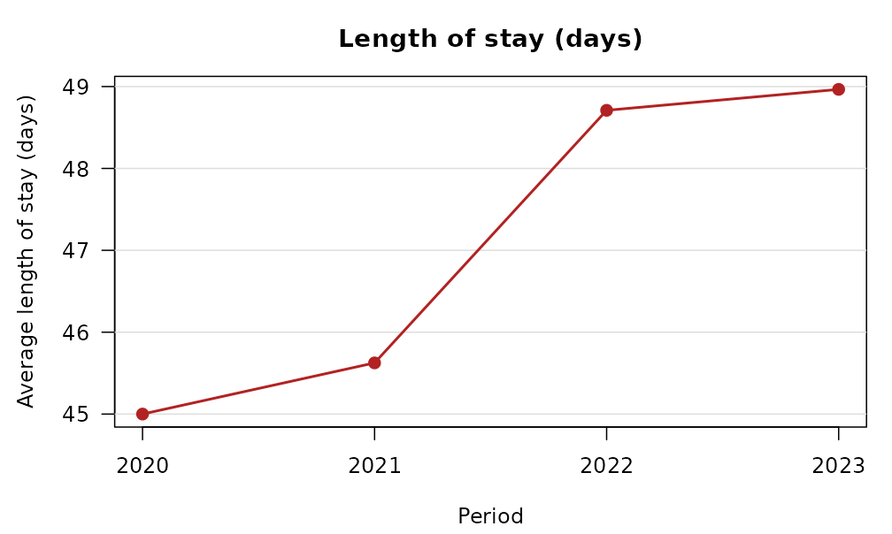

``` r

old <- bricklayer_plot_options(palette = "grey", grid = FALSE)
plot(y, what = "value")
```

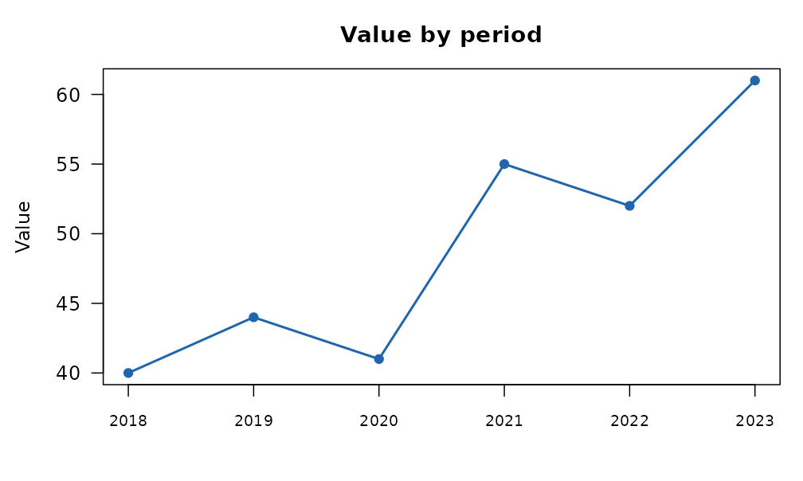

``` r

bricklayer_plot_options(palette = old$palette, grid = old$grid)
bricklayer_palette("okabe", 4)
#> [1] "#0072B2" "#D55E00" "#009E73" "#E69F00"
```

Every method returns the data it drew, invisibly:

``` r

drawn <- plot(y)
```

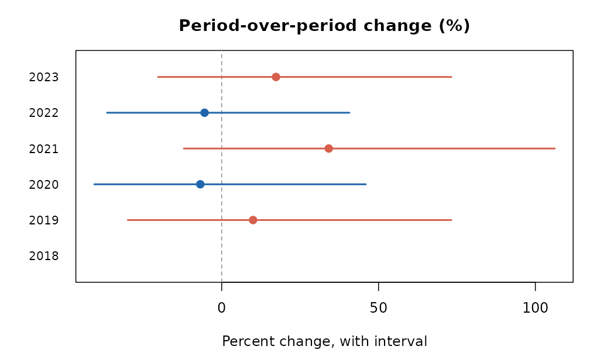

``` r

head(drawn, 3)
#>   label pct_change     lower    upper verdict
#> 1  2018         NA        NA       NA    <NA>
#> 2  2019  10.000000 -29.95683 73.20735      up
#> 3  2020  -6.818182 -40.61975 45.94265    down
```

Results that are plain data frames have a plot function of their own:
the Lorenz curve of a vector, and the funnel plot of observed against
expected counts per area.

``` r

plot_lorenz(c(1, 1, 2, 3, 5, 8, 13, 21))
```

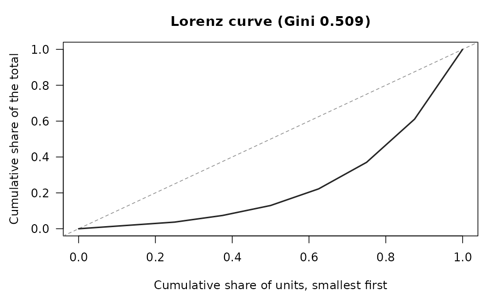

``` r

plot_funnel(observed = c(4, 20, 50, 9, 31), expected = c(5, 22, 40, 20, 30),
            area = c("a", "b", "c", "d", "e"))
```

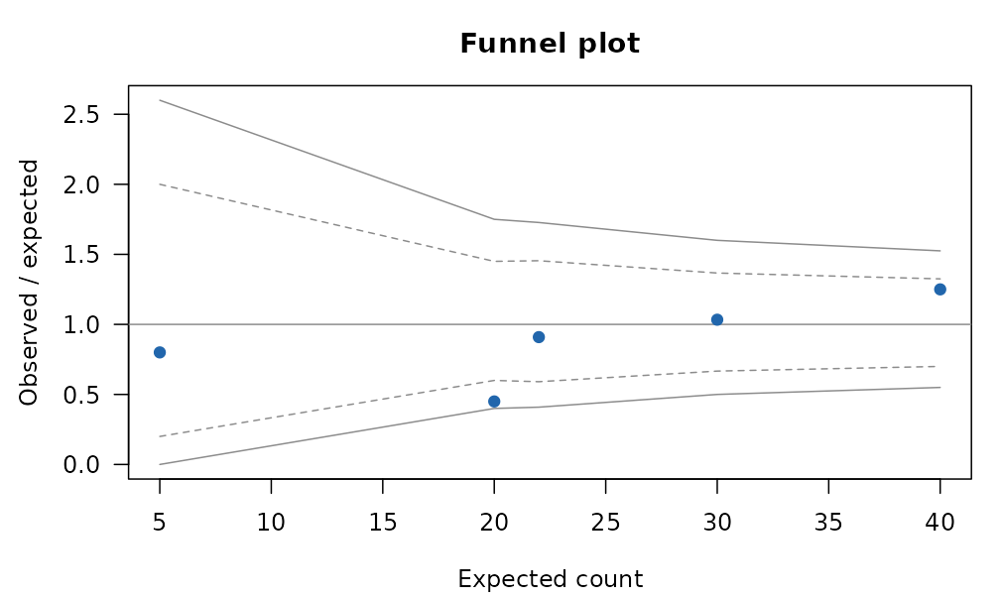
