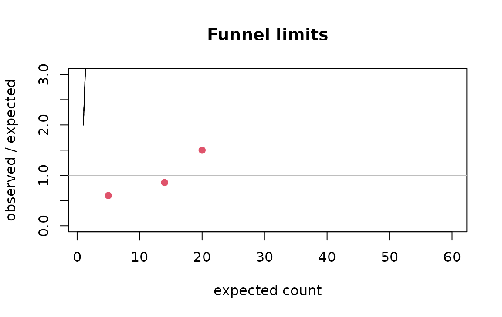

# Small-area rates: expected counts, shrinkage, funnels and spatial autocorrelation

Published tables often give a count per region, division or facility.
Comparing those counts fairly needs three steps: adjust for the
population each unit serves (and its composition), stabilise the ratios
of small units, and judge each unit against limits that widen as its
expected count shrinks. This vignette walks the four tools that do that.

## Expected counts by indirect standardisation

If the overall rate applied everywhere, how many events would each unit
have? That is the *expected count*. Adjusting for size alone:

``` r

d <- data.frame(
  region = rep(c("North", "South", "East"), each = 2),
  age = rep(c("18 to 24", "25 to 49"), 3),
  n = c(30, 45, 12, 60, 8, 20),
  pop = c(1000, 6000, 900, 9000, 400, 3500)
)
expected_counts(d$n, d$pop, d$region)
#>    area observed population expected
#> 1  East       28       3900 32.81250
#> 2 North       75       7000 58.89423
#> 3 South       72       9900 83.29327
```

Adjusting for size **and** age composition is indirect standardisation:
each stratum’s overall rate is applied to the unit’s population in that
stratum, then summed. This is the comparison that says something about
the unit rather than about who lives there:

``` r

expected_counts(d$n, d$pop, d$region, strata = d$age)
#>    area observed population expected
#> 1  East       28       3900 32.34430
#> 2 North       75       7000 62.27967
#> 3 South       72       9900 80.37603
```

## Standardised ratios with exact intervals

The ratio of observed to expected is the standardised incidence ratio
(SIR).
[`sir()`](https://rootcoder007.github.io/rmorie-bricklayer/reference/sir.md)
gives the exact Poisson interval, which is what makes a small count
honest:

``` r

sir(observed = c(30, 12, 3), expected = c(20, 14, 5),
    area = c("North", "South", "East"))
#>    area observed expected       sir     lower    upper excess deficit
#> 1 North       30       20 1.5000000 1.0120437 2.141343   TRUE   FALSE
#> 2 South       12       14 0.8571429 0.4428982 1.497256  FALSE   FALSE
#> 3  East        3        5 0.6000000 0.1237344 1.753455  FALSE   FALSE
#>   significant
#> 1        TRUE
#> 2       FALSE
#> 3       FALSE
```

An observed count of three carries almost no information, and the
interval says so rather than hiding it:

``` r

sir(3, 5)
#>   observed expected sir     lower    upper excess deficit significant
#> 1        3        5 0.6 0.1237344 1.753455  FALSE   FALSE       FALSE
```

## Empirical Bayes shrinkage

A tiny unit’s raw ratio is extreme by chance. Empirical Bayes shrinks
each ratio toward the overall experience in proportion to how little its
own data say: the pooled ratios share a Gamma prior whose parameters are
estimated from all units, and each unit’s posterior mean is a weighted
average of its own ratio and the prior mean, weighted by its expected
count (Clayton and Kaldor 1987).

``` r

eb_rates(observed = c(30, 45, 2), expected = c(25, 50, 0.5),
         area = c("North", "South", "Tiny"))
#>    area observed expected sir        eb shrinkage       nu    alpha
#> 1 North       30     25.0 1.2 1.1073869 0.5141392 26.98066 26.45506
#> 2 South       45     50.0 0.9 0.9414767 0.3460211 26.98066 26.45506
#> 3  Tiny        2      0.5 4.0 1.0751472 0.9814506 26.98066 26.45506
```

The tiny area’s raw ratio of 4 is pulled sharply toward 1; the large
areas barely move.

## Funnel plots

A funnel plot draws control limits that narrow as the expected count
grows (Spiegelhalter 2005): a ratio of 2 means nothing at an expected
count of 2 and a great deal at 200. Units outside the limits are the
ones worth a second look; the rest are consistent with the common rate.

``` r

funnel_limits(c(2, 20, 200))
#>   expected level lower upper
#> 1        2 0.950 0.000 2.500
#> 2       20 0.950 0.600 1.450
#> 3      200 0.950 0.865 1.140
#> 4        2 0.998 0.000 4.000
#> 5       20 0.998 0.400 1.750
#> 6      200 0.998 0.790 1.225
```

``` r

e <- seq(2, 200, length.out = 60)
lim <- funnel_limits(e)
plot(e, lim$upper_95, type = "l", ylim = c(0, 3), xlab = "expected count",
     ylab = "observed / expected", main = "Funnel limits")
lines(e, lim$lower_95)
lines(e, lim$upper_998, lty = 2)
lines(e, lim$lower_998, lty = 2)
abline(h = 1, col = "grey")
points(c(20, 14, 5), c(30, 12, 3) / c(20, 14, 5), pch = 19, col = 2)
```



The `levels` argument sets which limits are drawn; 95% and 99.8% (about
two and three standard deviations) are the conventional pair.

## Spatial autocorrelation

Rates of neighbouring areas are rarely independent. Moran’s *I* measures
whether similar values cluster in space, against a permutation null;
`neighbours` is a list giving each area’s adjacent areas:

``` r

nb <- list(2L, c(1L, 3L), c(2L, 4L), c(3L, 5L), c(4L, 6L), 5L)   # six areas in a line

set.seed(1)
morans_i(c(1, 2, 3, 4, 5, 6), nb, n_perm = 999L)[c("I", "p_value")]   # a gradient
#> $I
#> [1] 0.7142857
#> 
#> $p_value
#> [1] 0.011

set.seed(1)
morans_i(c(1, 6, 1, 6, 1, 6), nb, n_perm = 999L)[c("I", "p_value")]   # alternating
#> $I
#> [1] -1
#> 
#> $p_value
#> [1] 0.199
```

The null expectation of *I* is not zero but $`-1/(n-1)`$:

``` r

-1 / (6 - 1)
#> [1] -0.2
```

Positive autocorrelation in the residual ratios means neighbouring units
share something the standardisation did not capture, and a funnel that
treats them as independent is optimistic.

## From a published table to a judgement

1.  [`expected_counts()`](https://rootcoder007.github.io/rmorie-bricklayer/reference/expected_counts.md)
    with the strata the table publishes.
2.  [`sir()`](https://rootcoder007.github.io/rmorie-bricklayer/reference/sir.md)
    for the ratios and their exact intervals.
3.  [`eb_rates()`](https://rootcoder007.github.io/rmorie-bricklayer/reference/eb_rates.md)
    where small units dominate.
4.  [`funnel_limits()`](https://rootcoder007.github.io/rmorie-bricklayer/reference/funnel_limits.md)
    to see which units are outside the common experience.
5.  [`morans_i()`](https://rootcoder007.github.io/rmorie-bricklayer/reference/morans_i.md)
    on the residuals before trusting independence.

## References

Clayton, Kaldor (1987). Empirical Bayes estimates of age-standardized
relative risks for use in disease mapping. *Biometrics* 43(3).
Spiegelhalter (2005). Funnel plots for comparing institutional
performance. *Statistics in Medicine* 24(8). Moran (1950). Notes on
continuous stochastic phenomena. *Biometrika* 37(1/2).
